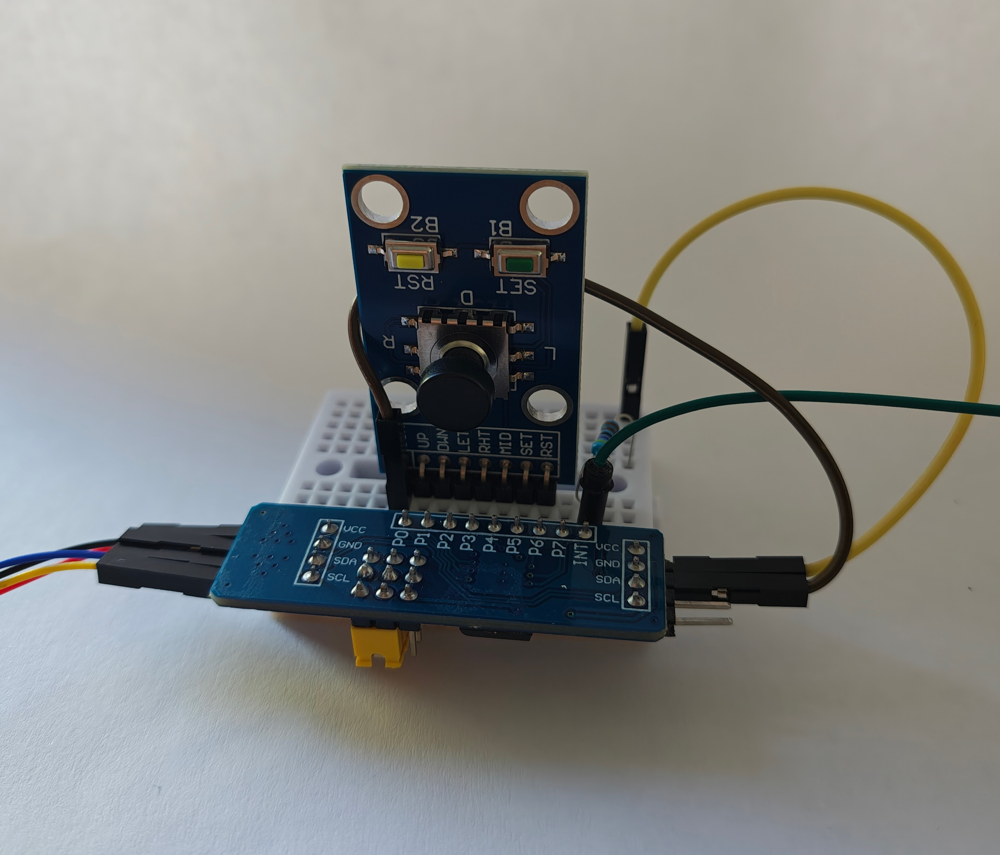

# IOExpander Joystick Input Example



Wiring up IOExpander input is in principle similar to wiring up output, with the added complexity that
we need to connect the interrupt pin in order to be notified about input changes: I2C is a host controlled
protocol, so the IOExpander has no way of informing the host about changes other than using this kind of
"side channel". Of course this is only necessary if we want to avoid a polling loop that queries
the IOExpander for updates all the time (the corresponding expander method is `poll()`).

## Hardware Setup

For the example hardware setup,

- connect some buttons (right, left, down up) between Pins P0, P1, P2 and P3 and GND., just like in the photo,
  where we use a ready-made joystick for the setup; then
- connect VCC, SDA, SCL, GND of the IO Expander to the corresponding pins 1, 3, 5 and 9 of your Raspberry PI again.
- Also connect one the "interrupt" pin of the MPC23017 to BCM 23 of your Raspberry PI. Make sure to pull it up by
  connecting it to 3.3V via a 4.7 kOhm resistor.
- Configure the address to 0x20 or adjust the code below accordingly.


## The Code

First, we do the "usual" basic Raspberry PI setup, obtaining the context:

```
public class JoystickExample {

    public static void main(String[] args) throws InterruptedException {
        Context context = Pi4J.newAutoContext();
```
We need to obtain an reference to the interrupt pin, so the Mcp23017 driver can listen on it, and forward
interrupts to the client pin objects as needed.        
```
        ListenableOnOffRead<?> interruptPin = context.create(DigitalInputConfig.newBuilder(context).bcm(23));
```
Next, we create a PCF 8574 driver instance, configured to input on address 0x20 on bus 1 and the interrupt pin instance
created above.
```
         InputExpander expander = Pcf8574Driver.createForInput(
            context.create(I2CConfig.newBuilder(context).bus(1).device(0x20)),
            interruptPin);
```

Now with all the configuration out of the way, we listen on the connected pins and print
their name and value. 

Note that we use the `addConsumer()` method to register a callback that will be
called whenever the pin changes value.

```
        expander.getInput(15).addConsumer((value) -> System.out.println("Up Key " + !value));
        expander.getInput(14).addConsumer((value) -> System.out.println("Down Key " + !value));
        expander.getInput(13).addConsumer((value) -> System.out.println("Left Key " + !value));
        expander.getInput(12).addConsumer((value) -> System.out.println("Right Key " + !value));
```
With all setup done, we loop forever, printing an "alive" statement every 10s.
Note that this does not do any polling.
```
        while (true) {
            System.out.println("Waiting for input..." + System.currentTimeMillis());
            Thread.sleep(10_000);
        }
    }
}
```

That's it!

If everything is set up correctly, running the program and moving the joystick should output 
something along these lines:

```
Waiting for input...1781445147941
Waiting for input...1781445157941
Up Key true
Up Key false
Up Key true
Up Key false
Down Key true
Down Key false
Down Key true
Down Key false
Left Key true
Left Key false
Right Key true
Right Key false
Left Key true
Left Key false
Right Key true
Right Key false
Waiting for input...1781445167941
```

The full `JoystickExample`code should be available in the GitHub side bar to the left.